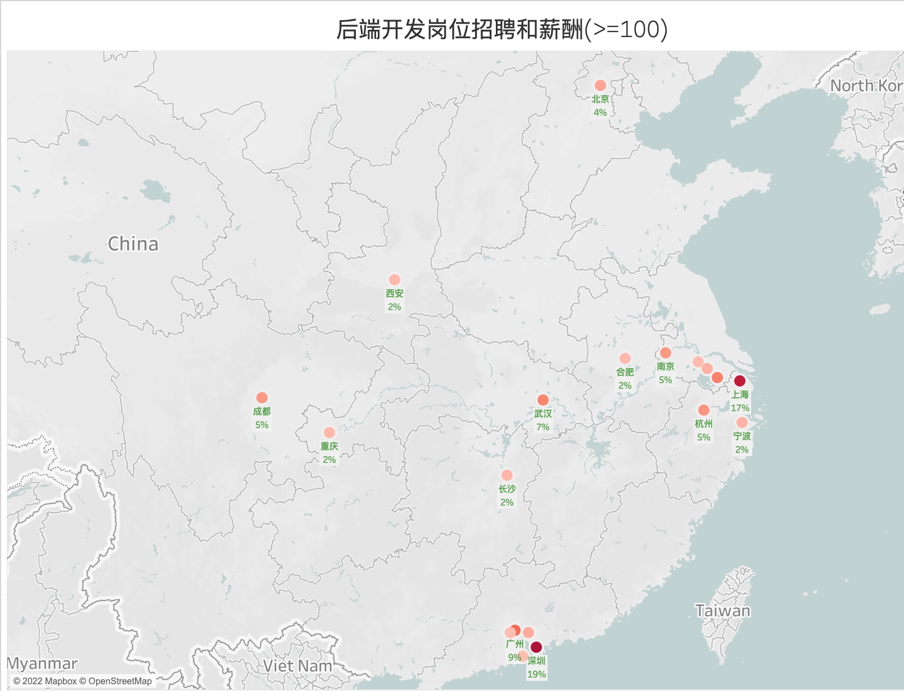
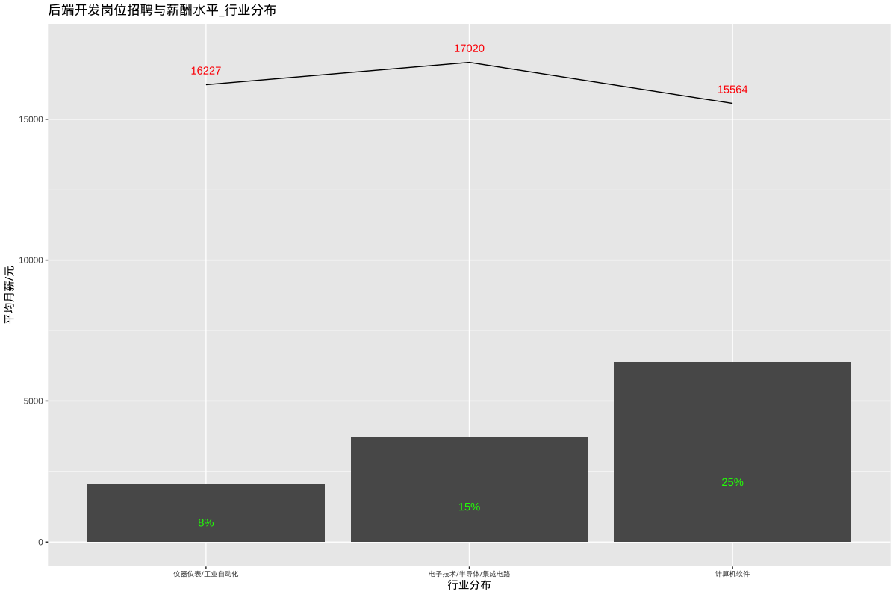
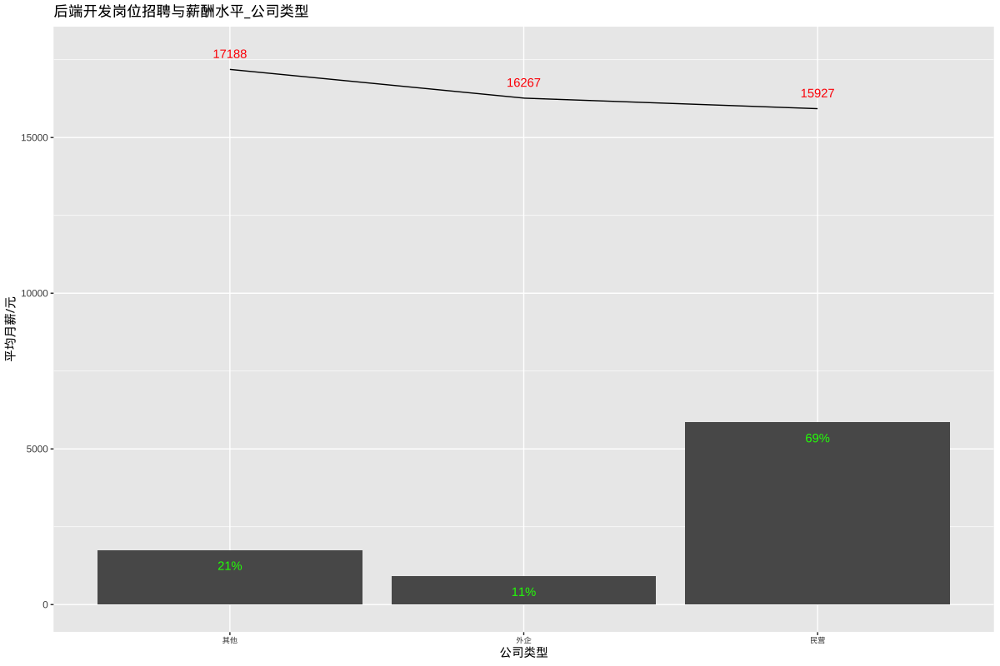
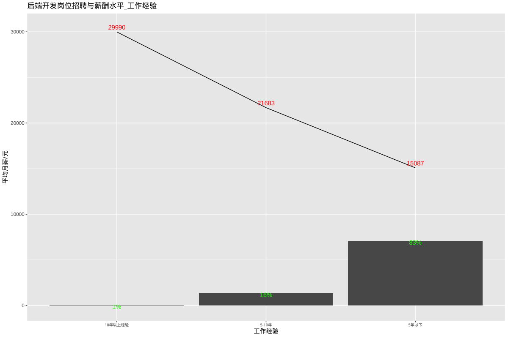
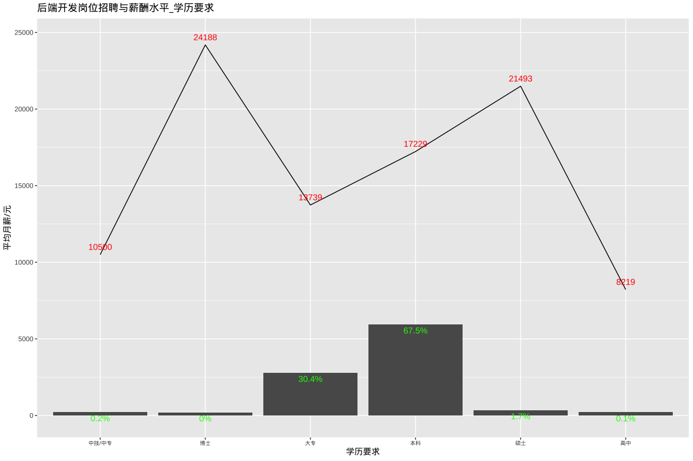

# 后端开发相关岗位招聘和薪酬水平

## 总述

本次采集有效数据8508条(城市发布量\>=100)，主要分析后端开发相关岗位招聘和薪酬水平，工程师岗位集中如：Java/Python/C#/C++/PHP/.NET/ABAP/嵌入式软件等。我们将分析如下方面：

-   01.城市分布：深圳占19%，平均月薪18253元；上海占17%，平均月薪19274元；其余城市均在9%或以下。

-   02.行业分布：计算机软件占25%，平均月薪15564元；电子技术/半导体/集成电路占15%，平均月薪占17020元；仪器仪表/工业自动化占8%，平均月薪16227元。

-   03.公司规模：1000人以下占84%，平均月薪16153元；1000-5000人占11%，平均月薪16475元。

-   04.公司类型：民企占69%，平均月薪15927元；外企占11%，平均月薪16267元。

-   05.工作经验：5年以下占83%，平均月薪15087元；5-10年占16%，平均月薪21683元。

-   06.学历要求：大专占30%，平均月薪13739元；本科占68%，平均月薪17229元。

## 01.城市分布

## 02.行业分布

## 03.公司规模

## 04.公司类型

## 05.工作经验

## 6.学历要求

